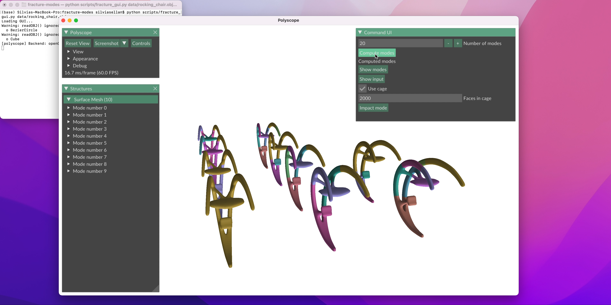
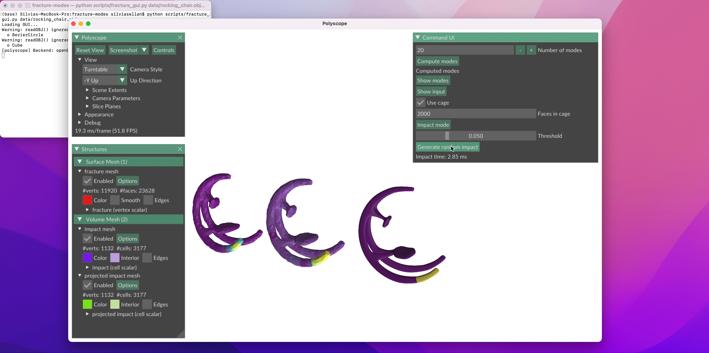

# Fracture Modes for Realtime Destruction

This is the code accompanying the *Transactions on Graphics* paper ["Breaking Good: Fracture Modes for Realtime Destruction"](https://www.silviasellan.com/data/pdf/fracture-harmonics.pdf), by Silvia Sellán, Jack Luong, Leticia Mattos Da Silva,
Aravind Ramakrishnan, Yuchuan Yang and Alec Jacobson.

## Installation

To install this library, start by cloning this repository 
```bash
git clone --recursive https://github.com/sgsellan/fracture-modes.git
```
Create a [`conda` environment](https://docs.conda.io/projects/conda/en/latest/index.html) using numpy
```bash
conda create -n fracture-modes python=3.9
conda activate fracture-modes
conda install numpy
```
Then, navigate to `gpytoolbox`:
```bash
cd ext/gpytoolbox/
```
and compile the dependency:
```bash
mkdir build
cd build
cmake ..
make -j8
```
Return to the main directory:
```bash
cd ../../..
```
and install all other dependencies:
```bash
conda install -c conda-forge igl
pip install tetgen
python -m pip install polyscope
conda install -c conda-forge scikit-sparse
pip install scikit-image
```
Finally, obtain a (free if you're academic) mosek licence [here](https://www.mosek.com/products/academic-licenses/), and install it as a python package:
```bash
conda install -c mosek mosek
```

You can validate your installation by running 
```bash
python scripts/example.py
``` 
which should complete in around 15 seconds and return a verbose wall of text ending with "Example ran successfully!"

Once this is done, 

## Use

You can use this library by adding this repository to your python path and importing `fracture_utility`. The following sample code will load a mesh and compute its fracture modes (see `scripts/example.py`):

```python
import numpy as np
import igl
import fracture_utility as fracture

# This is the "fine mesh", i.e. the mesh we use for rendering
v_fine, f_fine = igl.read_triangle_mesh("data/bunny_oded.obj")
v_fine = gpytoolbox.normalize_points(v_fine)
# This is the "cage mesh", i.e. the coarser mesh that we will tetrahedralize and use for the physical simulation
v, f = gpytoolbox.lazy_cage(v_fine,f_fine,num_faces=100)
# Tetrahedralize
tgen = tetgen.TetGen(v,f)
nodes, elements =  tgen.tetrahedralize()
# Initialize fracture mode class
modes = fracture.fracture_modes(nodes,elements) 
# Set parameters for call to fracture modes
params = fracture.fracture_modes_parameters(num_modes=10,verbose=True,d=3)
# Compute fracture modes
modes.compute_modes(parameters=params)
```

After running this code, the class attribute `modes.modes` will be populated with a `3num_tets` by `10` matrix containing the displacements of each tetrahedron in the mesh (row) for each mode (column).

Any runtime impact can be projected into our computed modes to obtain a realtime fracture with `modes.impact_projection`; for example, 
```python
# We need to precompute some stuff that we will only need to do once
modes.impact_precomputation(v_fine=v_fine,f_fine=f_fine)
# Optionally, you can use this to save each mode's segmentation in the current directory
modes.write_segmented_modes("output_modes")
contact_point = nodes[1,:]
direction = np.array([1.0,0.0,0.0])
# First projection, this should be fast
modes.impact_projection(contact_point=contact_point,direction=direction)
# Second projection, this should be fast
new_contact_point = nodes[5,:]
modes.impact_projection(contact_point=new_contact_point,direction=direction)
# Write segmented output to obj
modes.write_segmented_output("output.obj")
```

We also provide a graphical interface that you can use to get a quick idea of how our algorithm works. Open it by running 
```bash
python scripts/fracture_gui.py PATH/TO/FINE/MESH.obj
```
Your mesh will appear on screen surrounded by a coarse cage. You can tweak the size of the cage if you want using the slider. You can also change the number of modes you want to compute:


You can then press "Compute Modes". The console will show the progress, it shouldn't take more than one minute unless your cage is very fine. Once it is done, a message saying "Modes Computed" will appear. You can then press "Show Modes" to visualize all the possible fractures our modes identified:



Then, you can go to "Impact Mode", and click "Generate Random Impact". Three meshes will appear: one will show the norm of the impact as a scalar field on the cage mesh, the middle one will show the impact's projection onto our modes on the cage mesh, and the final mesh will be the fine mesh, segmented to show the pieces it would break on according to our algorithm with that given impact. Timing details will also appear on screen



Optionally, you can now press on "Save segmented output" to write the fine output to an `.obj` file. See `assets/sample_use.mp4` for a full recorded GUI example.

## Known Issues

Please do not hesitate to [contact me](sgsellan@cs.toronto.edu) if you find any issues or bugs in this code, or you struggle to run it in any way.

## Licensing

This code is released free for academic, non-commercial, non-military use. Contact [the authors](mailto:sgsellan@cs.toronto.edu) for commercial usage licensing.